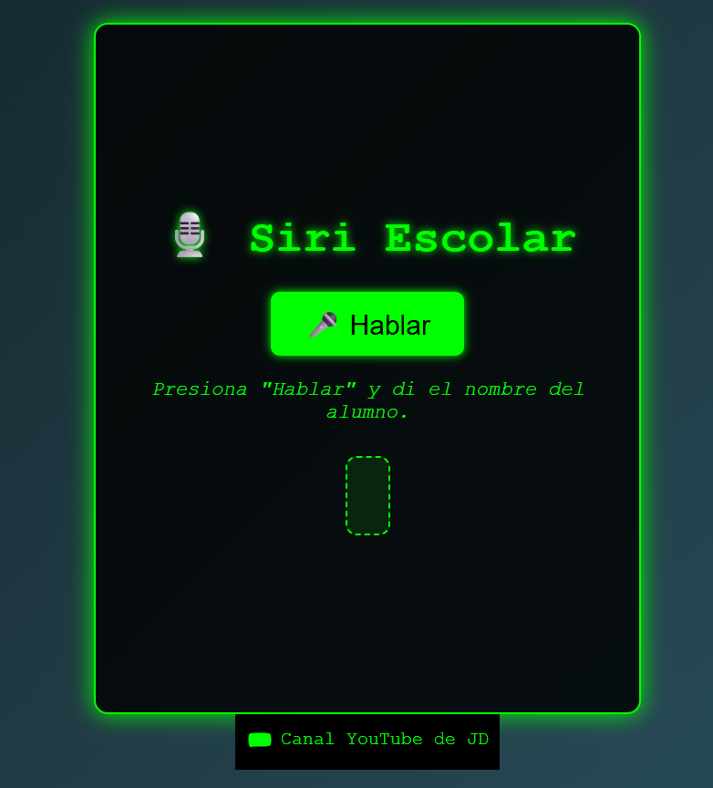

# 🎙️ Siri Escolar

**Siri Escolar** es una aplicación web educativa y humorística que utiliza reconocimiento de voz para identificar a estudiantes y generar descripciones personalizadas con un toque sarcástico, divertido y relacionado con la materia de informática. El asistente simula la voz de Siri para responder cuando un nombre es detectado por el micrófono.

---

## 🧠 ¿Cómo funciona?

- El usuario pulsa el botón de hablar.
- El sistema escucha la voz y convierte el audio en texto.
- Se buscan coincidencias de nombres o palabras clave.
- Si se encuentra un estudiante registrado, Siri Escolar devuelve una descripción única y entretenida.
- Si no se encuentra coincidencia, el sistema responde con un mensaje genérico.

---

## 🖼️ Vista previa



---

## 💡 Características

- Reconocimiento de voz en español (`SpeechRecognition` API).
- Respuestas habladas con `speechSynthesis`.
- Descripciones personalizadas por estudiante.
- Estilo humorístico, amigable y adaptado al contexto educativo.
- Funciona completamente en el navegador sin necesidad de servidores externos.

---

## 🚀 Tecnologías utilizadas

- HTML5
- CSS3
- JavaScript (vanilla)
- Web Speech API (`SpeechRecognition` y `speechSynthesis`)

---

## 🛠️ Instrucciones de uso

1. Clona el repositorio:

   ```bash
   git clone https://github.com/tu-usuario/siri-escolar.git

   Estructura
siri-escolar/
├── index.html
├── style.css
├── script.js
├── README.md
└── assets/
    └── image.png

✨ Autor
Proyecto desarrollado por JDUR como herramienta educativa para motivar e identificar estudiantes usando herramientas tecnológicas con un enfoque lúdico.

📄 Licencia
Este proyecto se distribuye bajo la Licencia MIT. Puedes usarlo, modificarlo y compartirlo libremente.